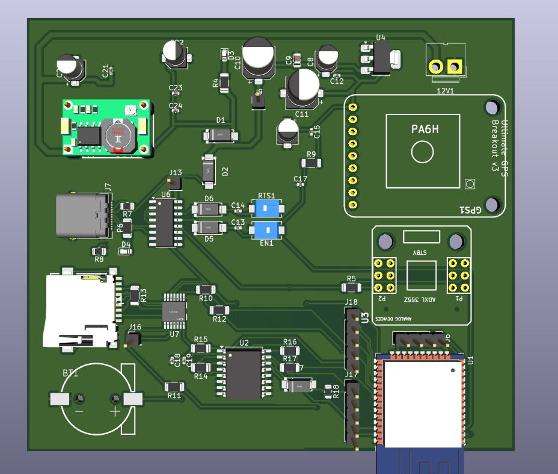
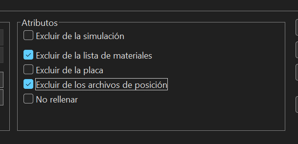
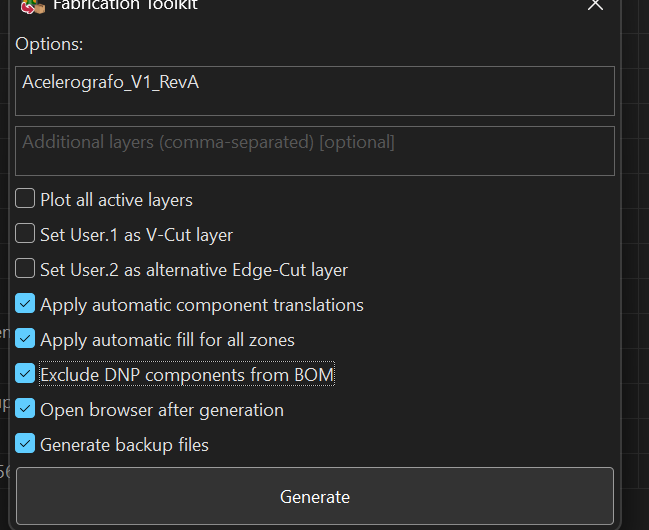

# Documentación técnica del PCB acelerográfico ESP32

**Proyecto:** Rediseño y estandarización del sistema acelerográfico de la Red Sísmica del Austro (RSA).  
**Responsable del trabajo según README:** Joel Suárez.  
**Entorno de diseño:** KiCad 10.  
**Fecha de revisión documental:** 7 de octubre de 2026.  
**Estado:** documentación del diseño y paquete exportado; pendiente de certificación eléctrica, de reglas y de ensamblaje.

## 1. Introducción y organización del proyecto

Este documento describe el entorno desarrollado para el PCB acelerográfico ESP32: proyecto KiCad, alimentación, bloques funcionales, bibliotecas locales, selección de componentes y preparación de archivos para fabricación PCBA. La estructura documental toma como referencia el README del Concentrador aportado, adaptando su organización al acelerógrafo. Los componentes, el origen EAGLE/Fusion del diseño y las rutas corresponden al proyecto acelerográfico; no se trasladan los datos del circuito Concentrador.

Las fuentes técnicas son el BOM `Acelerografo_ESP32.csv`, los archivos locales KiCad y las capturas proporcionadas. La organización del repositorio corresponde al árbol de carpetas aportado:

```text
RSA-Intern-HW-Acelerografo_ESP32_KiCad/
├── docs/
├── eagle_Images/
│   ├── images_pcb_3d_view/
│   └── images_schematic/
└── KiCad/
    ├── fabrication/
    ├── libs/
    │   ├── footprint/
    │   ├── JLC2KiCad_lib/
    │   │   └── RSA.pretty/
    │   │       └── packages3d/
    │   ├── LibExt.pretty/
    │   │   └── packages3d/
    │   ├── RSA.pretty/
    │   │   └── packages3d/
    │   └── symbol/
    └── projects/
        └── Acelerografo_ESP32/
            ├── .history/
            ├── production/
            └── _restore_backup_2026-09-14T22-53-35-565/
```

| Directorio | Función en el entorno |
|---|---|
| `docs/` | Documentación técnica del proyecto. |
| `eagle_Images/` | Capturas del esquemático y vistas 3D del diseño de referencia. |
| `KiCad/fabrication/` | Directorio disponible para organizar recursos de fabricación; no se encontraron archivos durante esta revisión. |
| `KiCad/libs/` | Símbolos, huellas y modelos 3D locales. |
| `KiCad/libs/JLC2KiCad_lib/` | Recursos adicionales generados por la herramienta de importación de componentes. |
| `KiCad/projects/Acelerografo_ESP32/` | Proyecto activo: `.kicad_pro`, `.kicad_sch`, `.kicad_pcb`, BOM y tablas de bibliotecas. |
| `KiCad/projects/Acelerografo_ESP32/production/` | Paquete de fabricación exportado mediante Fabrication Toolkit. |
| `.history/` y `_restore_backup_2026-09-14T22-53-35-565/` | Historial y respaldo del proyecto; no constituyen el paquete destinado al fabricante. |

El directorio `KiCad/fabrication/` y la carpeta `production/` del proyecto son ubicaciones diferentes. Los archivos exportados inspeccionados se encuentran en la segunda.
La revisión incluyó las tablas de bibliotecas, las opciones de Fabrication Toolkit, los CSV de producción y el inventario interno del ZIP de Gerbers. No se ejecutaron ERC ni DRC, no se realizó una auditoría completa de las conexiones, no se inspeccionaron gráficamente los Gerbers ni se cargó el paquete en JLCPCB. Tampoco se comprobó el firmware ni la correspondencia comercial de cada LCSC con su encapsulado. Las instrucciones de validación de este documento son pasos pendientes, no resultados aprobados.

## 2. Objetivo del proyecto

Reconstruir, auditar y estandarizar en KiCad 10 el sistema acelerográfico con ESP32 originalmente desarrollado en Autodesk Fusion Electronics/EAGLE, empleando las capturas y documentación disponibles como referencia. La placa integra adquisición de aceleración, almacenamiento local y referencias temporales, y busca mantener la compatibilidad con el firmware original.

El objetivo de fabricación es obtener un proyecto mantenible y portable, con componentes identificados mediante códigos LCSC para el ensamblaje PCBA en JLCPCB y una lista explícita de módulos y conectores instalados manualmente. La compatibilidad con el firmware y la aptitud para fabricación requieren las verificaciones eléctricas y de ensamblaje descritas en este documento.

## 3. Arquitectura general

```text
Entrada 12 V (12V1)
        │
        ▼
Módulo MP2307 (U8, montaje manual)
        │ 5 V
        ▼
LD1117S33 (U4)
        │ 3.3 V / alimentación digital prevista
        ▼
ESP32-WROOM-32 (U1)
        ├── SPI ── ADXL355Z (U3): adquisición acelerográfica
        ├── SPI ── 74LVC125 (U7) / MicroSD1: almacenamiento
        ├── UART ─ GPS1: referencia temporal y posicionamiento
        ├── I²C / SQW ─ RTC (U2) / BT1: reloj y respaldo
        └── UART ─ CH340G (U6) / USB-C (J7): comunicación/programación
```

El diagrama sintetiza la arquitectura prevista en el README y la solicitud de diseño; no reemplaza la auditoría pin a pin. El archivo PCB declara dos capas de cobre, `F.Cu` y `B.Cu`, y un espesor nominal de 1,6 mm. Estos son parámetros del diseño, no una confirmación de fabricación.

### 3.1 Alimentación 12 V → 5 V → 3,3 V

La etapa de reducción de 12 V a 5 V se implementa con un **módulo MP2307**, representado por U8. El CSV conserva el nombre genérico `STEP_DOWN_CONVERTER`; la identificación MP2307 procede de la definición del proyecto aportada por el usuario. La vista 3D muestra una pequeña placa convertidora completa en la zona superior izquierda, con inductor y elementos de regulación propios.

El módulo sustituye la implementación discreta de la etapa conmutada y se instala manualmente. La placa principal conserva condensadores externos: C20 de 220 µF y C21 de 100 nF en la zona de entrada, y C22 de 100 µF, C23 de 100 nF y C24 de 10 nF en la zona del convertidor. Su conexión exacta debe confirmarse en el esquemático; la lista de valores no certifica por sí sola su función eléctrica.

U4, `LD1117S33TR_SOT223`, realiza la regulación prevista de 5 V a 3,3 V. Su footprint es `SOT-223-3_TabPin2` y su código LCSC es C35879. Antes de conectar la electrónica digital, medir la salida del módulo a 5 V y la salida de U4 a 3,3 V; verificar pinout, polaridad, tensión admisible de condensadores, demanda máxima de corriente y disipación térmica. Documentar también el comportamiento con alimentación USB y externa simultánea mediante la revisión de las conexiones reales.

### 3.2 Bloques visibles en la captura

| Bloque | Referencias principales | Descripción y evidencia visual |
|---|---|---|
| Entrada y regulación | 12V1, U8, U4, C20–C24 | Conector de entrada arriba a la derecha, convertidor arriba a la izquierda y regulador U4 en la zona superior. |
| Control y comunicaciones | U1 | Módulo ESP32-WROOM-32 en el borde inferior derecho, con antena hacia el exterior. Revisar keepout en ambas capas. |
| Adquisición | U3 | Huella de la placa ADXL355Z en el lateral derecho, sobre el ESP32; la ausencia de cuerpo 3D no demuestra ausencia de montaje. |
| GPS | GPS1 | Área de breakout GPS en la zona superior derecha, rotulada con PA6H y su contorno mecánico. |
| Almacenamiento | MicroSD1, U7 | Portatarjetas en el lateral izquierdo inferior y buffer próximo a él. |
| Reloj y respaldo | U2, BT1 | RTC en la zona inferior central y huella del soporte de batería en la esquina inferior izquierda. |
| USB/serial | J7, U6 | USB-C en el borde izquierdo y CH340G en la zona central izquierda. |
| Control e indicación | EN1, RTS1, D3, D4 | Dos pulsadores centrales y LEDs distribuidos en la placa. |
| Interconexión y pasivos | J6, J9, J13, J16, J17, J18; R, C, D | Headers, acceso a señales, resistencias, condensadores y diodos según el BOM. |

La captura permite describir placement y presencia de huellas, pero no demuestra continuidad de planos GND, integridad de señales, cumplimiento de reglas ni montaje real. No se asigna aquí una función específica a cada diodo o resistencia sin auditar su red.

### 3.3 PCB final — vista 3D



**Figura: PCB final presentado por el usuario.** La vista muestra la distribución de la etapa de alimentación, el ESP32, los espacios para GPS y ADXL355, el puerto USB-C, el portatarjetas MicroSD y el RTC con soporte de batería. La imagen documenta la disposición física final mostrada; no representa una fotografía de una placa fabricada ni certifica ERC, DRC o validación en JLCPCB.
## 4. Librerías locales y portabilidad

La captura y `fp-lib-table` muestran dos bibliotecas de huellas específicas del proyecto:

| Apodo en KiCad | Directorio local | Uso identificado en el BOM |
|---|---|---|
| LibsExt | `KiCad/libs/LibExt.pretty` | Soporte CR1220, GPS_BREAKOUT_V3, MicroSD_holder, ADXL355Z y STEP_DOWN_CONVERTER. |
| LibsRSA | `KiCad/libs/RSA.pretty` | Huellas SMA para ES1D y TSSOP-14 para 74LVC125. |

`LibsExt` es el apodo; `LibExt.pretty` es el nombre real del directorio. No deben confundirse. Existen símbolos en `KiCad/libs/symbol/`, un archivo `KiCad/libs/RSA.kicad_sym` y modelos en subdirectorios `packages3d` de las bibliotecas.

**Estado observado:** las tablas aún utilizan rutas absolutas `C:/Users/Suarezc1224/Desktop/...`. Por tanto, la portabilidad no está completada. Además, `sym-lib-table` apunta a directorios para LibsExt y LibsRSA, en lugar de identificar archivos `.kicad_sym`; esta configuración requiere revisión y prueba de resolución de símbolos.

Como el proyecto reside en `KiCad/projects/Acelerografo_ESP32/`, las rutas relativas propuestas son:

```text
LibsExt (huellas): ${KIPRJMOD}/../../libs/LibExt.pretty
LibsRSA (huellas): ${KIPRJMOD}/../../libs/RSA.pretty
LibsRSA (símbolos, si se adopta RSA.kicad_sym): ${KIPRJMOD}/../../libs/RSA.kicad_sym
Modelo 3D local, ejemplo: ${KIPRJMOD}/../../libs/LibExt.pretty/packages3d/Convertidor STEP DOWN.step
```

Para los símbolos externos, registrar cada archivo `.kicad_sym` con el apodo correspondiente, o consolidarlos en una biblioteca válida y actualizar sus identificadores. No apuntar una biblioteca de símbolos KiCad a una carpeta como sustituto de un archivo. Mantener los apodos utilizados por los componentes o reasignarlos de forma coherente.

Después de ajustar las rutas, abrir una copia del repositorio en una ubicación distinta, comprobar símbolos, huellas y vista 3D, y revisar que no queden rutas personales. Los modelos oficiales que usan `${KICAD10_3DMODEL_DIR}` requieren las bibliotecas estándar correspondientes en el equipo receptor. Estas correcciones se documentan como propuestas; no se modificaron los archivos del proyecto durante esta tarea.

## 5. Flujo técnico del entorno desarrollado

El entorno reúne el proyecto KiCad, las bibliotecas locales, el BOM y los archivos de fabricación. Su organización permite mantener la relación entre el circuito, los componentes físicos y el paquete destinado a producción.

1. **Esquemático:** el archivo `Acelerografo_ESP32.kicad_sch` contiene la representación del circuito. Desde el editor se gestionan referencias, valores, conexiones y asignación de huellas.
2. **Bibliotecas:** `KiCad/libs/` reúne símbolos, huellas y modelos 3D. Las tablas del proyecto registran LibsExt y LibsRSA; las rutas relativas propuestas en la sección anterior facilitan trasladar el entorno a otro equipo.
3. **Componentes:** el campo LCSC identifica las piezas previstas para PCBA. Los módulos y conectores de montaje manual se mantienen en la BOM completa, separados del conjunto que se enviará a ensamblaje.
4. **PCB:** `Acelerografo_ESP32.kicad_pcb` contiene la distribución física y el ruteo. La captura 3D permite identificar los bloques y su disposición en la placa.
5. **Exportación:** Fabrication Toolkit genera el paquete en `production/`, con Gerbers, taladros, BOM y posiciones de componentes.
6. **Actualización:** después de cambiar el circuito o el layout, actualizar el PCB desde el esquemático, ejecutar las comprobaciones técnicas y regenerar el paquete para mantener los archivos de fabricación coherentes con el diseño.

Se confirmó la existencia de estos recursos. La revisión documental no incluyó la ejecución de las comprobaciones eléctricas ni la modificación de los archivos KiCad.
### 5.1 Configuración del entorno de trabajo

Abrir `KiCad/projects/Acelerografo_ESP32/Acelerografo_ESP32.kicad_pro` con KiCad 10. Mantener las bibliotecas estándar utilizadas por los footprints del BOM y registrar las bibliotecas locales en las tablas específicas del proyecto. Revisar la resolución de símbolos, huellas y modelos antes de actualizar el circuito.

Para la importación de componentes, disponer de Python y JLC2KiCadLib. Si se utiliza un entorno virtual, puede prepararse desde la raíz del repositorio:

```powershell
python -m venv .venv
.\.venv\Scripts\Activate.ps1
python -m pip install JLC2KiCadLib
jlc2kicadlib --help
```

Estos comandos describen la preparación del entorno y no se ejecutaron en esta revisión. La versión de Python debe ser compatible con la versión instalada de la herramienta; no se presupone que el entorno del Concentrador sea idéntico al del acelerógrafo.

El entorno incluye Fabrication Toolkit para exportar el paquete desde el editor PCB. Si se prepara otro equipo, instalar el complemento desde el administrador de complementos y contenidos de KiCad y comprobar que esté disponible en el editor.

### 5.2 Campos de componentes y mantenimiento

Mantener `Reference`, `Value`, `Footprint` y `LCSC` coherentes entre esquemático, PCB y exportación. `Qty` es la cantidad agrupada en el BOM. Los campos Datasheet, Description, fabricante y número de parte pueden complementar la identificación sin sustituir el LCSC ni el encapsulado real.

Los elementos manuales conservan su huella en la placa. Para excluirlos de los archivos de ensamblaje, revisar sus atributos de BOM y de posición según la configuración mostrada en la sección de fabricación. Mantener una BOM completa independiente para documentar tanto las piezas PCBA como las de instalación posterior.

Las bibliotecas compartidas se deben actualizar de forma controlada; después de cambiar una huella, comprobar pads, numeración, posición y modelo 3D. Mantener las modificaciones locales versionadas junto al proyecto.
## 6. Lista completa de componentes

La tabla se transcribe del CSV aportado sin sustituir valores ni footprints. Hay **32 filas agrupadas, 59 componentes físicos, 22 códigos LCSC únicos**, con **47 componentes previstos para JLCPCB** y **12 para montaje manual**. `—` representa una celda originalmente vacía. MicroSD1 tiene el campo Value vacío en el CSV.

Un código LCSC indica selección de catálogo y destino de ensamblaje previsto; no certifica stock, categoría Basic/Extended, compatibilidad de footprint ni aceptación del pedido.

### 6.1 Componentes con LCSC — ensamblaje JLCPCB previsto

| Reference | Qty | Value | Footprint | LCSC |
|---|---:|---|---|---|
| BT1 | 1 | Battery | LibsExt:CR1220-2-ext | C70381 |
| C8,C16 | 2 | 10uF | Capacitor_SMD:CP_Elec_4x5.4 | C3343 |
| C9 | 1 | 200nF | Capacitor_SMD:C_0805_2012Metric | C344170 |
| C10,C11 | 2 | 100uF | Capacitor_SMD:CP_Elec_6.3x7.7 | C3338 |
| C12,C13,C14,C15,C17,C19,C21,C23 | 8 | 100nF | Capacitor_SMD:C_0402_1005Metric | C1525 |
| C18 | 1 | 1uF | Capacitor_SMD:C_0402_1005Metric | C29266 |
| C20 | 1 | 220uF | Capacitor_SMD:CP_Elec_4x5.4 | C2858857 |
| C22 | 1 | 100uF | Capacitor_SMD:CP_Elec_4x5.4 | C970695 |
| C24 | 1 | 10nF | Capacitor_SMD:C_0402_1005Metric | C15195 |
| D1,D2,D5,D6,D7 | 5 | ES1D | LibsRSA:SMA_L4.4-W2.8-LS5.4-RD | C64878 |
| D3,D4 | 2 | LED | LED_SMD:LED_0603_1608Metric | C2290 |
| EN1,RTS1 | 2 | SW_Push | Button_Switch_SMD:SW_SPST_EVQPE1 | C720477 |
| MicroSD1 | 1 | — | LibsExt:MicroSD_holder | C53223918 |
| R4,R6,R14,R15,R16,R17 | 6 | 4.7k | Resistor_SMD:R_1206_3216Metric | C17936 |
| R5,R9 | 2 | 10k | Resistor_SMD:R_1206_3216Metric | C17902 |
| R7,R8 | 2 | 5.1k | Resistor_SMD:R_0805_2012Metric | C27834 |
| R10,R11,R12,R13 | 4 | 3.3k | Resistor_SMD:R_1206_3216Metric | C26010 |
| R18 | 1 | 200 | Resistor_SMD:R_0805_2012Metric | C17540 |
| U2 | 1 | DS3231M | Package_SO:SOIC-16W_7.5x10.3mm_P1.27mm | C9866 |
| U4 | 1 | LD1117S33TR_SOT223 | Package_TO_SOT_SMD:SOT-223-3_TabPin2 | C35879 |
| U6 | 1 | CH340G | Package_SO:SOIC-16_3.9x9.9mm_P1.27mm | C14267 |
| U7 | 1 | 74LVC125 | LibsRSA:TSSOP-14_L5.0-W4.4-P0.65-LS6.4-BL | C7813 |

### 6.2 Componentes sin LCSC — montaje manual / DNP-PCBA

Los campos LCSC vacíos son intencionales: estos módulos, conectores y elementos externos se excluyen del ensamblaje JLCPCB y se instalan posteriormente. DNP-PCBA significa que no se montan en fábrica, aunque sí forman parte del producto terminado. MicroSD1 y BT1 pertenecen a la tabla anterior porque tienen LCSC; no se excluyen por su categoría física.

| Reference | Qty | Value | Footprint | LCSC |
|---|---:|---|---|---|
| 12V1 | 1 | Conn_01x02 | Connector:JWT_A3963_1x02_P3.96mm_Vertical | — |
| GPS1 | 1 | GPS_BREAKOUT_V3 | LibsExt:GPS_BREAKOUT_V3 | — |
| J6 | 1 | Conn_01x04_Pin | Connector_PinHeader_2.54mm:PinHeader_1x04_P2.54mm_Vertical | — |
| J7 | 1 | USB_C_Receptacle | Connector_USB:USB_C_Receptacle_Amphenol_12401610E4-2A | — |
| J9 | 1 | IN_LD | Connector_PinHeader_2.54mm:PinHeader_1x01_P2.54mm_Vertical | — |
| J13,J16 | 2 | Conn_01x01_Pin | Connector_PinHeader_2.54mm:PinHeader_1x01_P2.54mm_Vertical | — |
| J17,J18 | 2 | Conn_01x05_Pin | Connector_PinHeader_2.54mm:PinHeader_1x05_P2.54mm_Vertical | — |
| U1 | 1 | ESP32-WROOM-32 | RF_Module:ESP32-WROOM-32 | — |
| U3 | 1 | ADXL355Z | LibsExt:ADXL355Z | — |
| U8 | 1 | STEP_DOWN_CONVERTER | LibsExt:STEP_DOWN_CONVERTER | — |

## 7. Importación con jlc2kicadlib

El siguiente comando PowerShell incluye exactamente los 22 códigos únicos del BOM, conservando el orden de primera aparición y los parámetros solicitados. Documenta una operación reproducible; no se ejecutó durante la generación de este informe.

```powershell
jlc2kicadlib `
C70381 C3343 C344170 C3338 C1525 C29266 C2858857 C970695 C15195 C64878 C2290 C720477 C53223918 C17936 C17902 C27834 C26010 C17540 C9866 C35879 C14267 C7813 `
-dir "C:\Users\Suarezc1224\Desktop\RSA-Intern-HW-Acelerografo_ESP32_KiCad\KiCad\libs" `
-symbol_lib RSA `
-symbol_lib_dir . `
-footprint_lib RSA.pretty `
-model_dir packages3d `
--skip_existing
```

Ejecutar en PowerShell con la herramienta instalada y sin espacios después de los acentos graves de continuación. Si cambia la ubicación del repositorio, ajustar `-dir`. Conservar `--skip_existing` y revisar el registro de importación; no asumir que actualiza o corrige componentes ya presentes. La descarga no sustituye la revisión de pinout, pads, orientación y dimensiones. Confirmar las rutas generadas de los modelos 3D y registrar las bibliotecas resultantes bajo los apodos del proyecto.

## 8. Carpeta production y Fabrication Toolkit

La carpeta `KiCad/projects/Acelerografo_ESP32/production/` contiene el paquete generado mediante **Fabrication Toolkit**, según el flujo descrito por el usuario y la presencia de sus opciones de exportación. **Sí se inspeccionó su contenido real a nivel de listado, CSV y entradas del ZIP.** No se realizó una inspección gráfica ni una validación de fabricación.

Los nombres genéricos `BOM.csv` y `CPL.csv` describen los entregables de materiales y posiciones; los archivos existentes usan los nombres siguientes:

| Archivo real | Función |
|---|---|
| `JLPCB_Acele-ESP32.zip` | Paquete de Gerbers y NC Drill. |
| `JLPCB_Acele-ESP32_bom.csv` | Equivalente funcional a BOM.csv: referencias, footprint, cantidad, valor y LCSC. |
| `JLPCB_Acele-ESP32_positions.csv` | Equivalente funcional a CPL.csv: Designator, Mid X, Mid Y, Rotation y Layer. |
| `JLPCB_Acele-ESP32_designators.csv` | Archivo auxiliar de designadores; se confirmó su presencia, sin evaluar su contenido. |
| `netlist.ipc` | Netlist auxiliar; se confirmó su presencia, sin validar conectividad. |

Dentro del ZIP se encontraron:

```text
Acelerografo_ESP32-F_Cu.gtl
Acelerografo_ESP32-B_Cu.gbl
Acelerografo_ESP32-F_Mask.gts
Acelerografo_ESP32-B_Mask.gbs
Acelerografo_ESP32-F_Paste.gtp
Acelerografo_ESP32-B_Paste.gbp
Acelerografo_ESP32-F_Silkscreen.gto
Acelerografo_ESP32-B_Silkscreen.gbo
Acelerografo_ESP32-Edge_Cuts.gm1
Acelerografo_ESP32-PTH.drl
Acelerografo_ESP32-NPTH.drl
Acelerografo_ESP32-PTH-drl_map.gbr
Acelerografo_ESP32-NPTH-drl_map.gbr
```

Los archivos `.drl` corresponden a taladros metalizados (PTH) y no metalizados (NPTH); los mapas asociados apoyan su revisión. No hay archivos literalmente llamados `BOM.csv` o `CPL.csv` en el listado revisado: deben seleccionarse sus equivalentes al cargar el pedido.

### 8.1 Configuración de exclusión y exportación mostrada

En las propiedades del componente, la captura aportada muestra activados **Excluir de la lista de materiales** y **Excluir de los archivos de posición**. **Excluir de la placa** permanece desactivado: el componente conserva su lugar físico en el PCB para el montaje manual.



Esta captura ilustra los atributos de un elemento; no demuestra por sí sola que se hayan aplicado a todas las referencias manuales. La exclusión de BOM y posición debe comprobarse para cada elemento de ese grupo. No equivale automáticamente a marcar DNP.

En Fabrication Toolkit se muestra el nombre de exportación **Acelerografo_V1_RevA** y las siguientes opciones:

| Opción | Estado visible |
|---|---|
| Apply automatic component translations | Activada. |
| Apply automatic fill for all zones | Activada. |
| Exclude DNP components from BOM | Activada. |
| Open browser after generation | Activada. |
| Generate backup files | Activada. |
| Plot all active layers | Desactivada. |
| Set User.1 as V-Cut layer | Desactivada. |
| Set User.2 as alternative Edge-Cut layer | Desactivada. |



Después de revisar los atributos y guardar el diseño, ejecutar **Generate**, comprobar el directorio de salida y revisar el contenido del BOM y del CPL. Conservar junto al paquete la revisión del proyecto de la que se exportó.

**Diferencia entre la captura y los archivos inspeccionados:** la nueva captura muestra exclusión DNP activada y el nombre `Acelerografo_V1_RevA`. El archivo de opciones todavía disponible en disco conserva `EXCLUDE DNP: false` y `ARCHIVE_NAME: JLPCB Acele-ESP32`; los archivos encontrados en `production/` usan el prefijo `JLPCB_Acele-ESP32`. Por tanto, la captura documenta la configuración presentada, pero no confirma que el paquete existente se haya regenerado con ella. No se encontró un paquete con el nombre nuevo en el listado revisado.

### 8.2 Observaciones del paquete existente en disco

- El BOM de producción todavía contiene las 32 filas, incluidos los componentes manuales sin LCSC. La opción `EXCLUDE DNP` figura como `false` en `fabrication-toolkit-options.json`. Los campos LCSC vacíos no prueban por sí solos que estos componentes se excluirán del pedido.
- El archivo de posiciones tiene 56 referencias, todas en `top`; incluye componentes de montaje manual. GPS1, U3 y U8 no aparecen en ese archivo. Para el pedido final, comprobar que BOM y CPL contengan exactamente el conjunto autorizado para PCBA.
- MicroSD1 aparece como `MICROSD1` en los archivos de producción y con valor `~`. Normalizar/verificar referencias y completar su descripción en el flujo de pedido sin confundir el marcador con una especificación comercial.
- Debe verificarse cada combinación LCSC/Value/Footprint contra la ficha del fabricante y la selección de JLCPCB. Esta revisión no certifica, por ejemplo, la correspondencia del nombre `DS3231M` con el encapsulado SOIC-16W indicado en el BOM.

Para obtener el paquete definitivo, marcar los componentes manuales como excluidos de PCBA mediante los atributos admitidos por la versión instalada del plugin, activar la exclusión aplicable y regenerar. Alternativamente, preparar BOM y CPL filtrados coherentemente para ensamblaje, conservando por separado la BOM completa. Confirmar el resultado exportado; no basta con cambiar una opción. No se modificó el paquete original durante esta tarea.

## 9. ERC y auditoría eléctrica

1. Abrir el proyecto y resolver las bibliotecas de símbolos antes de revisar el circuito.
2. Ejecutar ERC desde el editor de esquemáticos y registrar fecha, versión, errores y advertencias.
3. Revisar alimentación, pines sin conexión, nombres de red, salidas enfrentadas, entradas flotantes y pines de potencia. Utilizar marcas de no conexión y PWR_FLAG solo cuando el circuito lo justifique.
4. Auditar la cadena 12 V → módulo MP2307 → 5 V → LD1117S33 → 3,3 V, pinout del módulo, masas, polaridad y protección. Comprobar interacción entre USB y fuente externa.
5. Comparar con el firmware GPIO de ADXL355 y MicroSD por SPI, GPS por UART, RTC por I²C/SQW y CH340G por UART/DTR/RTS. Registrar una tabla de señal, GPIO, pin físico y evidencia de firmware.
6. Corregir incidencias y repetir ERC; justificar cualquier exclusión de forma individual. Actualizar el PCB desde el esquemático.

**Resultado de ERC en esta revisión: no ejecutado.** No se declara cero errores ni compatibilidad de firmware verificada.

## 10. DRC y revisión física

1. Seleccionar las reglas de fabricación del servicio y stackup que se contratarán: separación, anchos, vías, taladros y distancias a bordes.
2. Rellenar zonas de cobre y ejecutar DRC en el editor PCB; revisar conexiones sin rutear, cortocircuitos, separaciones, taladros, contorno y courtyards.
3. Revisar continuidad y retornos de GND en ambas capas, desacoplos cercanos a los pines, longitud de SPI y ubicación del acelerómetro respecto de la etapa conmutada.
4. Comprobar keepout de antena ESP32, interferencias mecánicas, acceso a USB/MicroSD, altura de módulos, polaridad y pin 1. Revisar los puntos de prueba y la disposición de fiduciales para el ensamblaje.
5. Resolver errores y advertencias o registrar la justificación técnica de cada excepción.
6. Guardar la revisión aprobada y regenerar todos los archivos de producción desde ella.

**Resultado de DRC en esta revisión: no ejecutado.** La vista 3D y el ZIP existente no acreditan cumplimiento de reglas.

## 11. Validación del pedido en JLCPCB

1. Cargar el ZIP de Gerbers y revisar capas, dimensiones, contorno, máscara, serigrafía y taladros en el visor. Confirmar dos capas y espesor previsto de 1,6 mm según el pedido elegido.
2. Elegir ensamblaje en las caras que correspondan al diseño final; la exportación actual contiene posiciones en top.
3. Cargar el BOM de PCBA y el CPL coherentes, excluyendo las 12 referencias físicas de montaje manual. Mantener su lista para la instalación posterior.
4. Verificar para cada LCSC valor, part number, fabricante, encapsulado, stock y clasificación Basic/Extended. Resolver el Value vacío de MicroSD1 y cualquier incompatibilidad detectada.
5. Revisar la vista de ensamblaje referencia por referencia: coordenadas, unidades, origen, cara, rotación, pin 1 y polaridad. No interpretar automáticamente las coordenadas Y negativas como error; comprobar su resultado en el visor.
6. Comprobar que ninguna pieza manual figure en el ensamblaje solicitado, que no falte ninguna pieza aprobada y que cantidades de BOM y CPL coincidan.
7. Archivar capturas del visor, BOM/CPL aceptados, revisión del proyecto y lista de incidencias resueltas antes de aprobar la fabricación.

**Estado de validación JLCPCB: pendiente; no se cargó ni se aprobó un pedido en esta tarea.**

## 12. Montaje manual y puesta en marcha

Tras recibir la placa ensamblada, inspeccionar soldaduras y orientación de componentes. Instalar 12V1, GPS1, J6, J7, J9, J13, J16, J17, J18, U1, U3 y U8 conforme al esquema y a la lista de montaje manual. Revisar especialmente el sentido de entrada/salida del convertidor y los conectores de módulos.

Antes de energizar, comprobar ausencia de cortocircuitos en las líneas de alimentación. Verificar 5 V y 3,3 V con alimentación controlada antes de conectar los módulos sensibles. Después, comprobar programación y comunicación del ESP32, lectura de los tres ejes del acelerómetro, escritura/lectura de MicroSD, comunicación GPS y funcionamiento del RTC y su respaldo. Registrar mediciones, versión de firmware y resultados.

## 13. Estado técnico de los archivos del entorno

| Elemento | Estado documental observado |
|---|---|
| Proyecto KiCad y vista 3D | Disponibles; revisión eléctrica integral pendiente. |
| BOM completa | 32 filas / 59 componentes, transcrita en este documento. |
| Separación de montaje | 47 componentes PCBA previstos / 12 manuales documentados; exclusión en exportación pendiente. |
| Importación LCSC | Comando preparado con 22 códigos únicos; no ejecutado aquí. |
| Librerías locales | Presentes; rutas absolutas y entradas de símbolos por corregir/verificar. |
| Fabrication Toolkit / production | Paquete presente e inventariado; inspección gráfica y aceptación pendientes. |
| ERC / DRC | Sin resultados certificados en esta revisión. |
| Firmware y pruebas de banco | Pendientes de auditoría y evidencia. |

La liberación para fabricación requiere completar la portabilidad, auditar las partes y conexiones, cerrar ERC/DRC, regenerar BOM/CPL con exclusión coherente del montaje manual y validar el paquete en JLCPCB.


